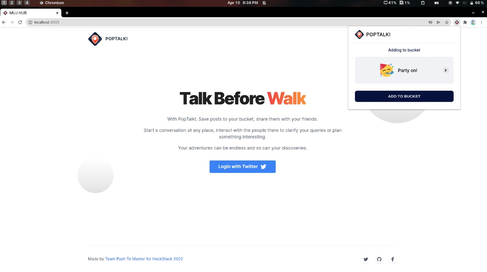
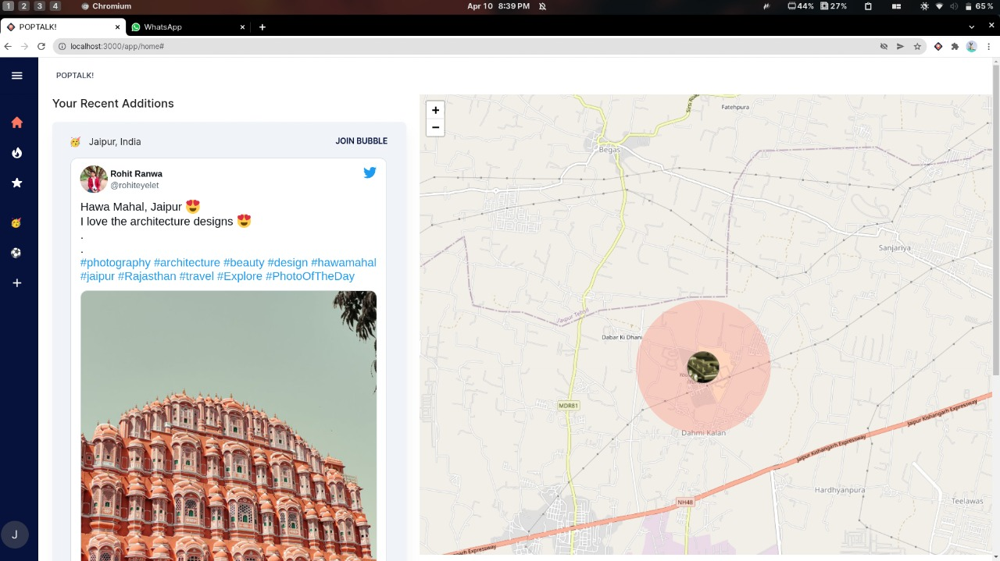
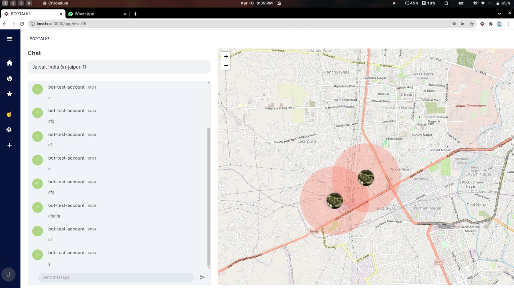

 

  

  <h2 align="center">POPTALK!</h2>
   
  
Talk before you walk!

  

    Build Bucket Lists from social media of the places you want to visit and discover new places. Start a conversation, interact and go explore.
     
    <a href="https://github.com/manavendrasen/poptalk/issues">Report Bug</a>
    ·
    <a href="https://youtu.be/A6l8yGgv7YY">Video Demo</a>
    ·
    <a href="https://www.canva.com/design/DAE9efgRm10/j0KedxJ8faVXq4KVk2wT-Q/view">Presentation</a>
  

  
Table of Contents

  <ol>
    <li>
      <a href="#problem">Problem</a>
    </li>
    <li><a  href="#challenges">Challenges</a></li>
    <li><a href="#technologies-used">Technologies Used</a></li>
    <li><a href="#architecture">Architecture</a></li>
    <li><a href="#contact">Contact</a></li>
  </ol>

### Problem 

Why?

- People want to discover new places to visit and travel to.
- People want to interact and clarify their doubts regarding the place.
- People want to store and track their travel bucket lists.

What does PopTalk do?

 - Allows people to add #wanderlust posts from social media to their bucket list.
 - Allows people to join location-based chatrooms and interact with people around the location.
  

### Screenshots 

### Challenges 

   - Social Media platform APIs are restrictive due to privacy controls. We made a browser extension where the user will choose to bookmark a post. No user activity is tracked, thus maintaining user privacy.
   - Allowing users to signup and log in using social media accounts in chrome extension and web app.
   - Creating temporary chat channels and allowing users to authenticate and chat using their Twitter profile.
   - Packing our solution into a seamless User Interface and Experience. Deployment on different platforms.

### Technologies Used

#### Frontend

- [React.js](https://reactjs.org/)
- [MUI](https://mui.com/)
- [Recoil](https://recoiljs.org/)
- [React Leaflet](https://react-leaflet.js.org/)
- [Pubnub](https://www.pubnub.com/)

#### Backend

- [Node.js](https://nodejs.org/en/)
- [Express.js](https://expressjs.com/)
- [Supabase](https://supabase.com/)
  
#### Language
- [Typescript](https://www.typescriptlang.org/)
- [Javascript](https://developer.mozilla.org/en-US/docs/Web/JavaScript)
   

### Architecture

### Contact

- [Manavendra Sen](https://www.linkedin.com/in/manavendrasen/)
- [Somil Gupta](https://www.linkedin.com/in/somil-gupta-142973195/)
- [Divyanshu Sharma](https://www.linkedin.com/in/d1vshar/)
- [Ayush Agarawal](https://www.linkedin.com/in/ayush-agrawal-86143a190)

